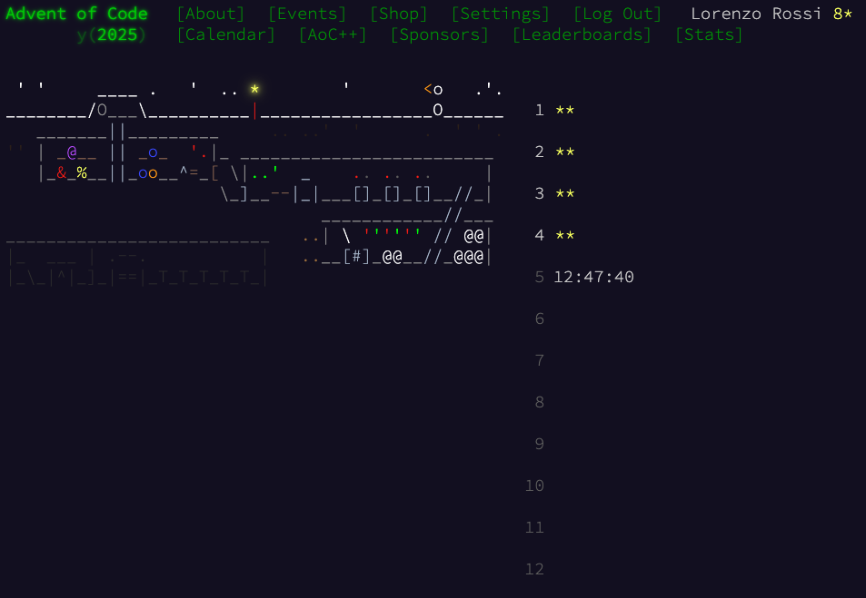

# Advent of Code 2025

Solutions in R for the [Advent of Code 2025](https://adventofcode.com/2025). To complicate things a bit, I'm trying to solve all problems with only **base** R. No libraries allowed.

